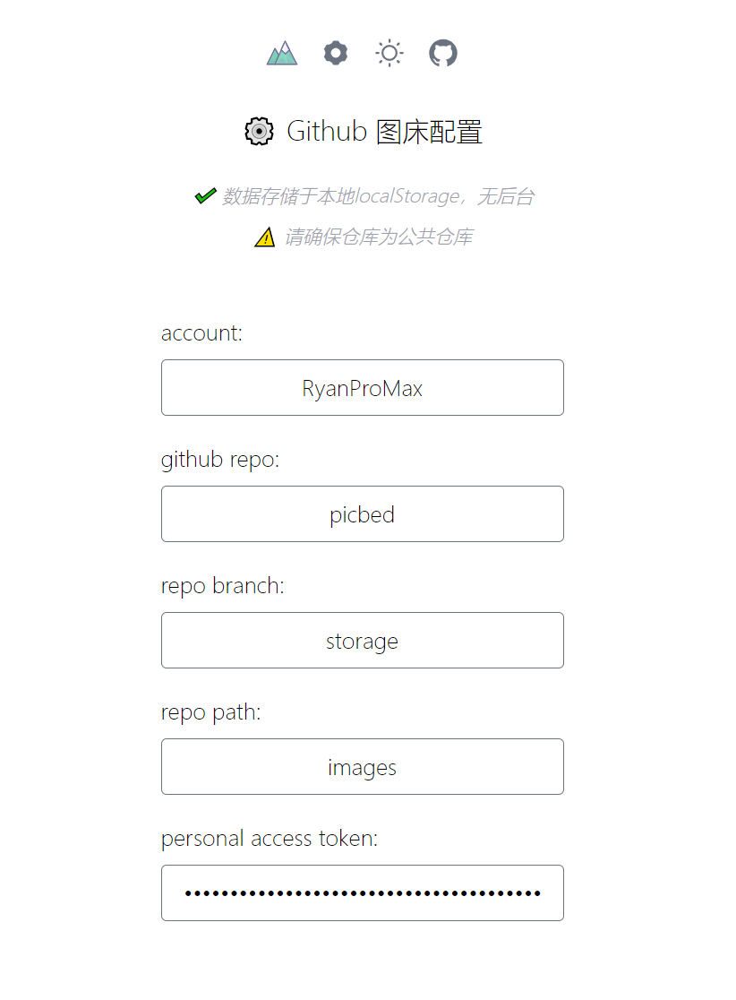

# Picbed

基于 Github 的图床管理方案。

Live Demo: https://ryan-picbed.netlify.app/

# Usage

## 1. 在 Github 上创建一个仓库，作为图床仓库

## 2. 生成私人访问令牌（personal access token）

https://github.com/settings/tokens ，勾选 repo 部分权限即可

## 3. 登录 https://ryan-picbed.netlify.app/

按照提示完成配置即可

> account: github 账户名
>
> github repo: github 仓库名
>
> repo branch: github 仓库分支
>
> repo path: github 仓库路径，根目录无需设置
>
> personal access token: 第二步生成的令牌
>
> 以上信息存储于本地 localStorage 中，无后台，可放心使用

## 4. 返回首页上传/管理你的图床吧！

# Q&A

## 1. 请求路径

格式: https://raw.githubusercontent.com/${account}/${repo}/${feature}/${filepath}

example: https://raw.githubusercontent.com/RyanProMax/picbed/storage/images/profile.picture.01.png

## 2. 国内可采用 jsDelivr 加速

example: https://cdn.jsdelivr.net/gh/RyanProMax/picbed@storage/images/profile.picture.01.png
